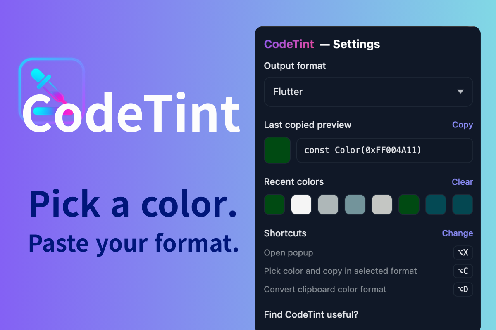
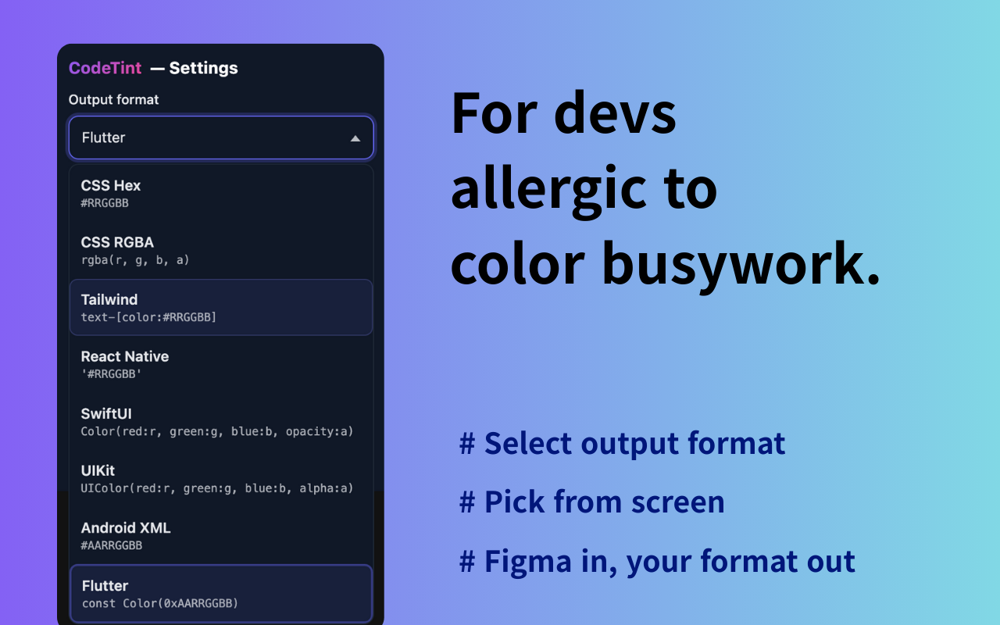

# 🎨 CodeTint

**Pick colors. Paste code.**  
A tiny Chrome extension to grab any on-screen color and copy it in your favorite format.

  
  

## ✨ Features
- 🧪 Eyedropper anywhere on the page
- ⚡ One-click copy in multiple formats:
  - **CSS Hex**: `#RRGGBB`
  - **CSS RGBA**: `rgba(r, g, b, a)`
  - **Tailwind**: `text-[color:#RRGGBB]`
  - **React Native**: `'#RRGGBB'`
  - **SwiftUI**: `Color(red: r, green: g, blue: b, opacity: a)`
  - **UIKit**: `UIColor(red: r, green: g, blue: b, alpha: a)`
  - **Android XML**: `#AARRGGBB`
  - **Flutter**: `const Color(0xAARRGGBB)`

## 🚀 Install (Dev Mode)
1. Clone this repo  
2. Open `chrome://extensions`  
3. Enable **Developer mode**  
4. **Load unpacked** → select the repo folder `/src`

> MV3 — no build step needed.

## ⌨️ Shortcuts
Set your own at `chrome://extensions/shortcuts` (suggested: **Alt + C** to pick).

## 🔒 Privacy
No tracking or analytics. Everything runs locally.  
(External links only when you click Sponsor / Buy me a coffee.)

## ❤️ Support
If CodeTint helps you:

- [**GitHub Sponsors**](https://github.com/sponsors/eclipse25)  
- [**Buy Me a Coffee**](https://www.buymeacoffee.com/eclipse25)

☕ **$5+** sponsors/tips are listed in `SUPPORTERS.md` at quarter end (KST). Opt-out on request.

## 📜 License
MIT
